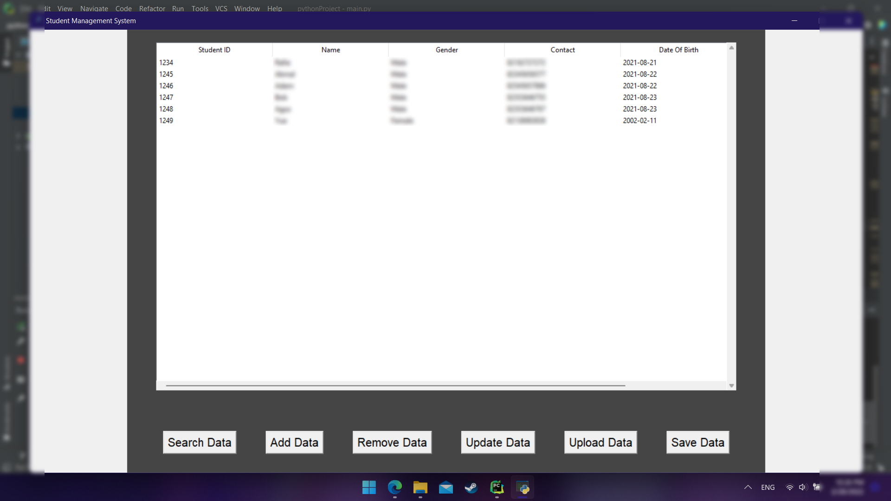

#  <center>Student Management System | Quiz SE</center>
####  <center> :black_nib: Documentation: </center>



#### :black_nib: Features:
- MySQL database
- Validation of input
- Add data
- Search data
- Remove data
- Update data
- Upload data using CSV file
- Saving table data to CSV file
- Exception handling

#### :black_nib: Prerequisites:
- Python 3 [Download Python3](https://www.python.org/downloads/)
- MYSQL/XAMPP [Download XAMMP](https://www.apachefriends.org/download.html)
- Import student.sql file in phpmyadmin

#### :black_nib: MYSQL database and table:
```
Database: student 
Table: students
```


#### :black_nib: How to Run this Project?
- Clone this project or Download Zip.
- Extract it and Open the Project.
- Open terminal or cmd and run following command.
```shell
$ pip3 install pymysql
$ pip3 install mysqlclient
$ pip3 install tk
$ pip3 install pandas
$ pip3 install sqlalchemy
$ pip3 install mysql-connector-python
$ python3 main.py
```

#### Arigatou :octocat:

